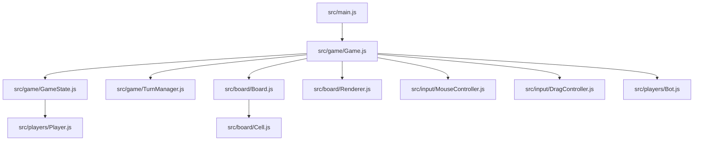

# Barricade.gg (Quoridor Board Game)

A high-fidelity, highly optimized web implementation of the classic strategy board game **Quoridor**, built using vanilla JavaScript, HTML5, and CSS Grid. It features local Pass & Play, four AI bot difficulties (including depth-2 Minimax with Alpha-Beta pruning), a slate-themed responsive UI with light/dark modes, and local storage state persistence.

---

## 1. Game Rules

The game is played on a **9x9 grid** with 2 players: **Player 1 (Red)** and **Player 2 (Blue)**.

### Objectives
- **Player 1 (Red)** starts at cell `E1` (column index 4, row index 0) and must reach any cell on row `9` (row index 8).
- **Player 2 (Blue)** starts at cell `E9` (column index 4, row index 8) and must reach any cell on row `1` (row index 0).
- The first player to reach their target row wins the match.

### Actions on a Turn
Each turn, a player must perform exactly one of the following two actions:
1. **Move their Pawn**: Travel to an adjacent available cell.
2. **Place a Barricade (Wall)**: Position a wall to obstruct the opponent's path.

---

### Pawn Movement & Jumps
- **Standard Moves**: A pawn can move one cell orthogonally (Up, Down, Left, Right), provided there is no wall blocking the path. Diagonal moves are not allowed under normal circumstances.
- **Pawn Adjacency**: If the two pawns are adjacent orthogonally, they can jump:
  1. **Straight Jump**: If the cell behind the opponent is empty and not blocked by a wall, the active player can jump straight over the opponent's pawn.
  2. **Diagonal Jump**: If the cell behind the opponent is blocked by a wall or is off-board, the active player can jump diagonally to either side of the opponent's cell (left or right, relative to the jump axis), provided no walls block those diagonal paths.

---

### Barricades (Walls)
- **Inventory**: Each player starts with **10 barricades**.
- **Dimensions**: Every barricade spans exactly **two cell widths** (or heights) and fits inside the grid line gaps.
- **Horizontal Walls**: Placed in the horizontal tracks, spanning two columns.
- **Vertical Walls**: Placed in the vertical tracks, spanning two rows.
- **Placement Rules**:
  1. **Grid Bounds**: Must sit completely within the board borders.
  2. **No Overlap**: Cannot be placed on top of or overlap another placed wall of the same orientation.
  3. **No Crossing**: Cannot cross perpendicular walls (e.g. a vertical wall cannot intersect the exact midpoint of a horizontal wall).
  4. **No Total Blockade**: A wall placement is **illegal** if it completely blocks the remaining path to the target row for either player. Each player must always have at least one valid path to their goal.

---

## 2. Architecture & Codebase Layout

The project follows a decoupled **Model-View-Controller (MVC)** structural design.



### 1. Controllers (Orchestration)
- [src/main.js](file:///var/www/html/Barricade/src/main.js): Bootstraps the application and instantiates the orchestrator.
- [src/game/Game.js](file:///var/www/html/Barricade/src/game/Game.js): Orchestrates player turns, integrates AIs, handles storage state saving/loading, and manages modal popup events.
- [src/game/TurnManager.js](file:///var/www/html/Barricade/src/game/TurnManager.js): Enforces game turn progression, validates moves, and evaluates win conditions.

### 2. Models (State)
- [src/game/GameState.js](file:///var/www/html/Barricade/src/game/GameState.js): Stores pawn positions, wall coordinates, move history, active difficulty selections, and serializes state schemas into JSON.
- [src/board/Board.js](file:///var/www/html/Barricade/src/board/Board.js): Models the logical 9x9 grid nodes.
- [src/board/Cell.js](file:///var/www/html/Barricade/src/board/Cell.js): Represents individual cell coordinate properties.
- [src/players/Player.js](file:///var/www/html/Barricade/src/players/Player.js): Manages individual player properties (column, row, wall inventory).

### 3. Views (Rendering & UI)
- [src/board/Renderer.js](file:///var/www/html/Barricade/src/board/Renderer.js): Visualizes the grid, path markers, active pawn positions, and placed walls using CSS Grid layout coordinates.
- [src/ui/Sidebar.js](file:///var/www/html/Barricade/src/ui/Sidebar.js): Manages turn cards, wall counters, and control button events.
- [src/ui/MoveHistory.js](file:///var/www/html/Barricade/src/ui/MoveHistory.js): Renders structural notations (e.g. `e3`, `he4`) in the history feed.
- [src/ui/Toast.js](file:///var/www/html/Barricade/src/ui/Toast.js): Displays system notifications for invalid placements or blocked paths.
- [src/ui/DragPreview.js](file:///var/www/html/Barricade/src/ui/DragPreview.js): Manages the visual rendering of the snaps and ghost wall hover guides on the grid.

### 4. Input & Interaction
- [src/input/MouseController.js](file:///var/www/html/Barricade/src/input/MouseController.js): Captures board clicks, snaps previews to grid coordinates, and filters out box hovers so previews only render inside the lines.
- [src/input/DragController.js](file:///var/www/html/Barricade/src/input/DragController.js): Manages HTML5 drag events, custom drag images, and drop operations.

### 5. Game Logic & AI Algorithms
- [src/players/Movement.js](file:///var/www/html/Barricade/src/players/Movement.js): Generates standard legal moves and jump options.
- [src/players/JumpRules.js](file:///var/www/html/Barricade/src/players/JumpRules.js): Implements the logical check rules for straight/diagonal pawn jumps.
- [src/walls/WallValidator.js](file:///var/www/html/Barricade/src/walls/WallValidator.js): Validates wall placement logic, including boundary limits, overlaps, crosses, and path blocking.
- [src/pathfinding/BFS.js](file:///var/www/html/Barricade/src/pathfinding/BFS.js): **Highly optimized pathfinder**. Uses $O(1)$ coordinate sets to avoid array scans, and traces paths via parent pointers to eliminate object allocation overhead.
- [src/players/Bot.js](file:///var/www/html/Barricade/src/players/Bot.js): Handles AI bot moves:
  - **Easy**: Selects a random legal move or wall placement.
  - **Medium**: Prefers pawn movement along the shortest path; occasionally places blocking walls.
  - **Hard**: Actively pursues the shortest path while aggressively placing blocking walls if the opponent gets too close.
  - **Professional (Minimax)**: Computes a depth-2 Minimax search with Alpha-Beta pruning, scoring outcomes using path lengths and wall distributions.

---

## 3. Storage Serialization Schema

Matches are saved automatically in `localStorage` under key `barricade_game_state_v1` on any action. The JSON structure is:

```json
{
  "currentPlayer": 0,
  "players": [
    { "playerIndex": 0, "col": 4, "row": 2, "walls": 9 },
    { "playerIndex": 1, "col": 4, "row": 7, "walls": 10 }
  ],
  "horizontalWalls": [
    { "col": 4, "row": 3 }
  ],
  "verticalWalls": [],
  "history": ["e2", "he4", "e3"],
  "winner": null,
  "gameMode": "ai",
  "botDifficulty": "professional",
  "humanPlayerIndex": 0
}
```

---

## 4. Visual Styles & Styling Tokens

All layouts are styled in [styles/style.css](file:///var/www/html/Barricade/styles/style.css) using CSS variables for dark/light themes. Key variables include:
- `--cell-size`: Cell dimensions (58px max).
- `--gap-size`: Gap dimensions between cells (14px max).
- `--wall-placed`: Color theme for placed walls (#e2e8f0 in dark mode).

### Z-Index Stacking Order
1. `.board-cell`: default/relative (stacking layer 0)
2. `.player-token`: `z-index: 10`
3. `.wall-placed`: `z-index: 20`
4. `.wall-preview` (ghost previews): `z-index: 30` and `position: relative` (to ensure it sits above cells).

---

## 5. Guide for Future Enhancements

If you want to extend this project, here are the recommended entry points:

### 1. Adding Multiplayer WebSockets
- **Where to edit**: `Game.js` and `TurnManager.js`.
- **How**: Replace local turn execution logic with network events. Send move/wall specs to a server and listen for incoming actions, updating `gameState.deserialize(data)` upon receiving network ticks.

### 2. Improving Bot AI (Depth-3+ Search)
- **Where to edit**: `Bot.js`.
- **How**: Web Workers can be used to run deeper Minimax searches (depth 3 or 4) asynchronously, avoiding freezes in the UI thread while the bot evaluates complex game states.

### 3. Undo/Redo System
- **Where to edit**: `GameState.js` and `Game.js`.
- **How**: Add an actions stack array. Since the history notation captures all actions (pawn moves and wall locations), an action can be undone by restoring the initial state and replaying the history up to `history.length - 1`.
